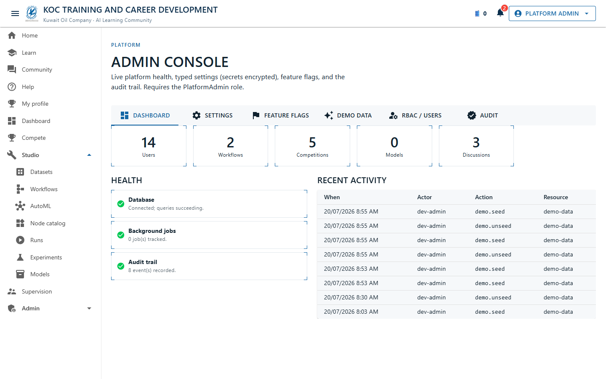
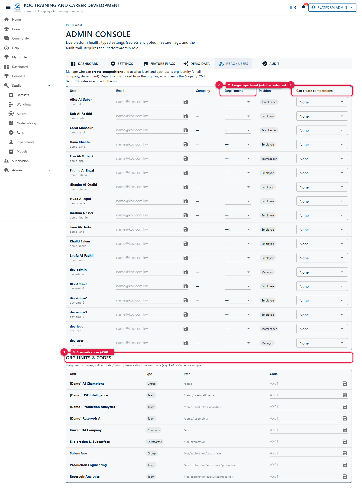
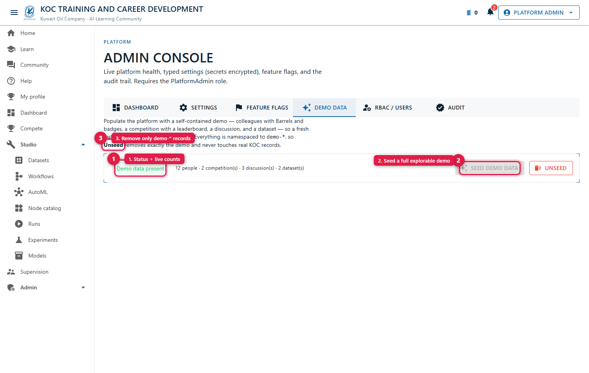
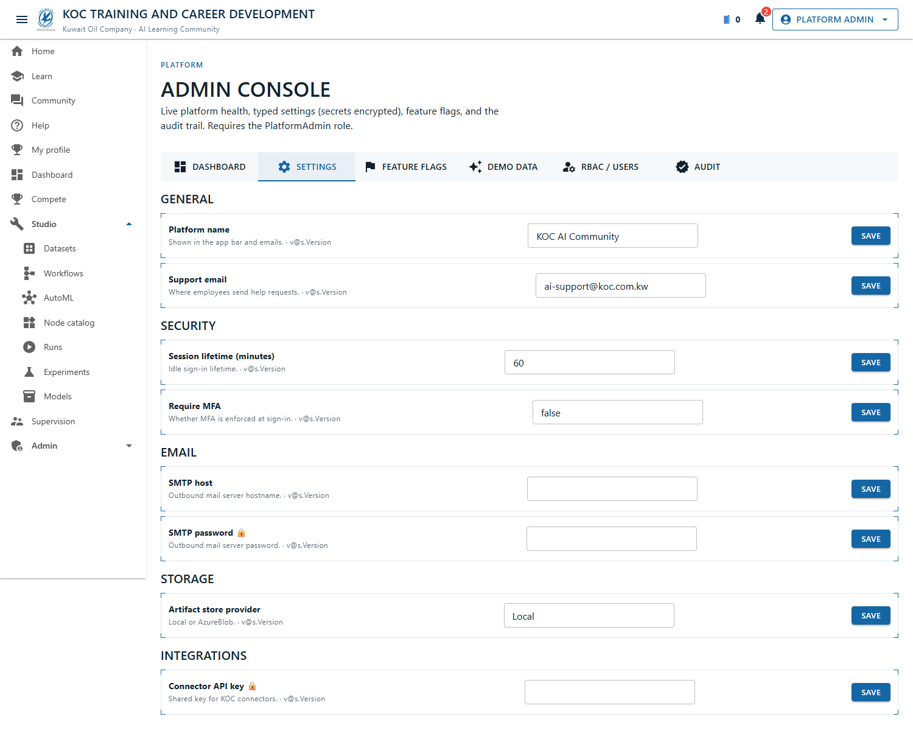
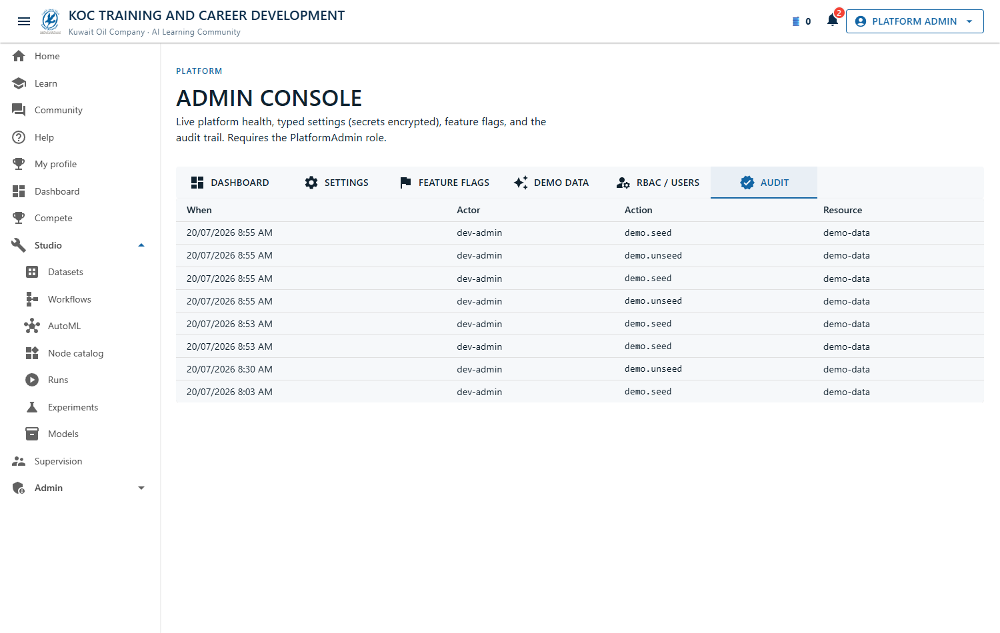
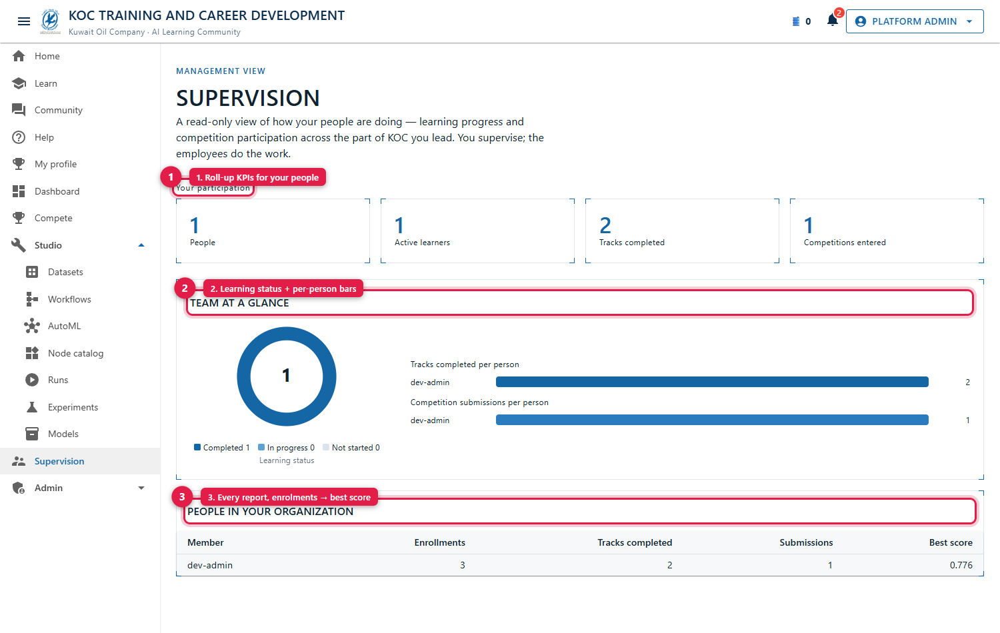

# Administrator Guide — Beep.KocAiCommunity

A manual for **Platform Administrators** running the KOC Training & Career Development platform: how to
manage users and access, run competitions, seed demo content, tune settings, and read the audit trail.

> This guide is about *operating* a running instance. For building/extending the code see
> [`docs/DEVELOPER_GUIDE.md`](DEVELOPER_GUIDE.md); for deployment/hosting see
> [`docs/DEPLOYMENT.md`](DEPLOYMENT.md).

---

## 1. Who can administer

The admin console requires the **`PlatformAdmin`** role. Roles come from your sign-in:

- **Intranet / production**: your real KOC identity (Microsoft Entra, or IIS Windows SSO on the
  intranet — no separate login). Roles are assigned in your identity provider (and, for competitions,
  via grants in the console — see §3).
- **Dev/demo**: a **"view as" persona switcher** in the app bar (Employee … Platform Admin). Pick
  **Platform Admin** to reach the console.

Two role families exist: **positions** (Employee → TeamLeader → Manager → DCEO → CEO) and **function
roles** (PlatformAdmin, CompetitionAdmin, LearningAdmin, Auditor).

## 2. The Admin Console (`/admin`)

Open **Admin → Console**. It has these tabs:

| Tab | What you do |
|---|---|
| **Dashboard** | Live KPIs (users, workflows, competitions, models, discussions), health, recent audit. |
| **RBAC / Users** | Manage who can create competitions + at what level; set users' org/department + email; assign org-unit codes. |
| **Settings** | Typed platform settings (secrets stored encrypted), edited per key. |
| **Feature flags** | Toggle features on/off with a rollout percentage. |
| **Demo data** | Seed / unseed a self-contained explorable demo. |
| **Audit** | The full admin action trail. |

## 3. RBAC / Users — the core admin task

This is where you control **who can create competitions and how widely**, and record each user's
**org identity**.

### Org structure & codes

KOC is modelled as a tree: **Company → Directorate → Group → Team**. Each unit can carry a short
**business code** (e.g. `AX01` for a team, `KOC` for the company). In **RBAC / Users → Org units &
codes**, assign each unit its code. Codes are **unique**.

### A user's identity

Each user has an **email**, a **Company ID** and a **Department ID** — the last two are org-unit **codes**.
When you set a user's **department** (pick a unit from the list), the platform writes the department code
**and** derives the company-root code together, so they never drift. Department & profile fields can also
be enriched automatically from the KOC directory once that API is connected.

### Competition-creation grants

By default **no one can create competitions** except Platform Admins. To let someone host:

1. Find the user in the **Users** table.
2. In the **"Can create competitions"** dropdown, pick their **maximum level**:
   `None / Team / Group / Directorate / Company`.
3. The level is a **ceiling** — granting *Directorate* also allows *Group* and *Team* competitions.
   Choosing **None** revokes the grant.

Every grant/revoke, profile edit, and org-code change is written to the **Audit** trail.

## 4. Competitions

- **Who can create**: only granted users (§3) + Platform Admins. A user's create wizard only offers the
  levels they're entitled to; the server enforces it (an over-scope attempt is rejected).
- **Lifecycle**: a competition moves through **draft → active → concluded**. Set a **reveal time** to keep
  the final leaderboard hidden until a chosen day; the **live** leaderboard updates in real time.
- **Data**: the host uploads the **training** set (labelled, downloadable), the **evaluation** set (no
  label), and the **hidden answer key** (only the platform sees it, used to score). Participants submit a
  Studio pipeline, which is trained + scored server-side against the hidden key.
- **Audience**: a competition is scoped to Team / Group / Directorate / Company via org-scoped visibility —
  only people in that scope see and enter it.

## 5. Demo data

**Admin → Demo data** seeds a full explorable demo — colleagues with Barrels/badges, a competition with a
leaderboard, a discussion, and a dataset — so a fresh install is immediately explorable. Everything is
namespaced `demo-*`, so **Unseed** removes exactly the demo and never touches real KOC records. The status
chip shows whether demo data is present and its counts.

While demo data is seeded, **every visitor sees a bilingual (English / Arabic) "Demonstration
environment" notice** on first load, so no one mistakes the sample colleagues or results for real KOC
records. It disappears automatically once you **Unseed** (and never shows on a production Entra /
Windows-SSO deployment).

## 6. Settings & feature flags

- **Settings**: typed configuration grouped by category (e.g. platform name, support email, session
  lifetime, SMTP, storage provider). **Secret** settings (passwords, API keys) are stored **encrypted** and
  shown masked. Editing bumps a version and is audited.
- **Feature flags**: enable/disable features with an optional **rollout percentage** (a stable per-user
  bucket), and add new flags.

## 7. Audit trail

**Admin → Audit** lists every administrative action (settings changes, grants, demo seed/unseed, org-code
edits) with the actor, action, resource, timestamp, and before/after where relevant. Filter by action.
Use it to answer "who changed what, when".

## 8. Supervision (for people-leaders)

Users who **lead** an org unit (TeamLeader/Manager/DCEO/CEO) get **`/supervision`** — a read-only rollup of
their people's learning and competition activity. This is not part of the admin console but is role-gated
the same way (a leader position, or Platform Admin).

## 9. Identity & sign-in modes (for admins/ops)

The platform authenticates in one of three modes (configured at deploy time):

| Mode | When | Config |
|---|---|---|
| **Dev auth** | Local dev / demo | default (no config); persona switcher forwards `X-Dev-*` headers |
| **Microsoft Entra** | Cloud / federated | set `AzureAd` (TenantId, ClientId, …) |
| **Intranet Windows SSO** | On-prem intranet, no login | `WindowsAuth:Enabled=true` on the Web + IIS Windows Authentication (Anonymous off) |

With Windows SSO, employees are signed in **automatically** from their intranet session; the platform uses
their real account. See [`docs/DEPLOYMENT.md`](DEPLOYMENT.md) and the README "Production auth" section.

## 10. The desktop app (for your users)

Users can install the **KOC Studio** desktop app — the same workflow designer, running **offline**: they
build and run ML pipelines locally (no server), and connect to the network only to **submit to a
competition**. It signs them in silently with their Windows account (no extra login). Nothing extra to
administer beyond ensuring the competitions API is reachable from their machines.

## 11. Troubleshooting

| Symptom | Likely cause / fix |
|---|---|
| "You need the PlatformAdmin role" on `/admin` | You're not signed in as an admin — switch persona (dev) or check your Entra/AD role. |
| Admin dashboard shows 0 users | No org/profile data yet — seed the dev org or connect the directory. (There is no separate API to check: the platform surface runs inside the website.) |
| A user can't create a competition | They have no active creator grant — set their level in RBAC / Users. |
| "You can only create competitions up to X scope" | The user targeted an audience wider than their granted maximum — raise their grant or pick a narrower scope. |
| Duplicate org code rejected | Codes are unique — pick a free code. |
| Competition final board is empty/locked | It's before the **reveal time**, or the answer key/datasets aren't set. |
| Desktop app: competitions unavailable | Since 2026-08-02 KOC Studio reads the database directly — check its connection string, not a network path to a server. The designer still works with no database at all. |

## 12. Reference

- Product overview & running: [`README.md`](../README.md)
- Feature/architecture history & decisions: `plans/koc-ai-community-platform/` (+ `MASTER_TODO_TRACKER.md`)
- RBAC design: `plans/koc-ai-community-platform/MASTER_TODO_TRACKER.md` (Admin RBAC section)
