# User Guide — KOC Training & Career Development

Welcome! This platform helps you **learn AI/ML, practice on real KOC problems, and compete** with
colleagues. This guide walks through everything you can do as an employee.

> Administering the platform? See the [Administrator Guide](ADMIN_GUIDE.md). Building it? See the
> [Developer Guide](DEVELOPER_GUIDE.md).

---

## 1. Signing in

On the KOC intranet you're signed in **automatically** with your work account — there's no separate
login. Your name appears in the top-right of the app bar. (In a demo/dev build you'll instead see a
**"view as"** switcher there to preview the app as different roles.)

If the platform is running on **sample demonstration data**, a short bilingual (English / Arabic)
notice greets you on first load, making clear that the colleagues, competitions, and results shown are
illustrative — not real records. Dismiss it with **I understand · أفهم**; it won't nag you again for
the rest of your session.

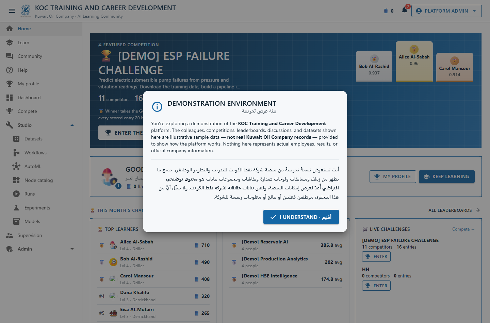

What you can see depends on your role: everyone gets **Learn, Community, Compete, and the Studio**;
people-leaders also get **Supervision**; platform administrators get the **Admin** console.

## 2. The home page & getting around

The left menu is your map: **Home, Learn, Community, Help**, your **profile** and **dashboard**, **Compete**,
and the **Studio** group (Datasets, Workflows, AutoML, Node catalog, Runs, Experiments, Models). A live
**notification bell** in the app bar tells you when a competition concludes, someone replies to you, or you
earn a badge.

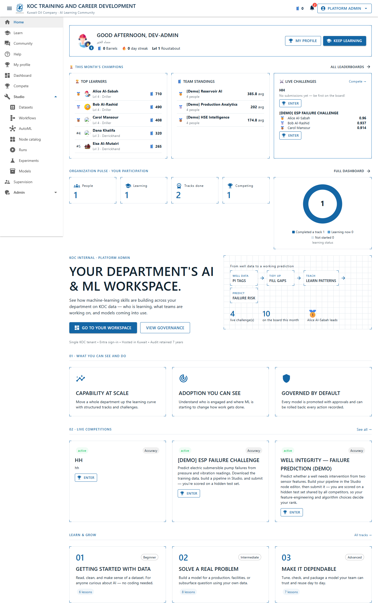

## 3. Learn — guided tracks

**Learn** offers structured tracks with real lessons.

1. Open **Learn** and pick a track.
2. **Enroll**, then work through the lessons in order.
3. Mark lessons complete; finishing a track records a **completion** and earns you standing.

Some competitions recommend a track to start with — a handy on-ramp if the topic is new to you.

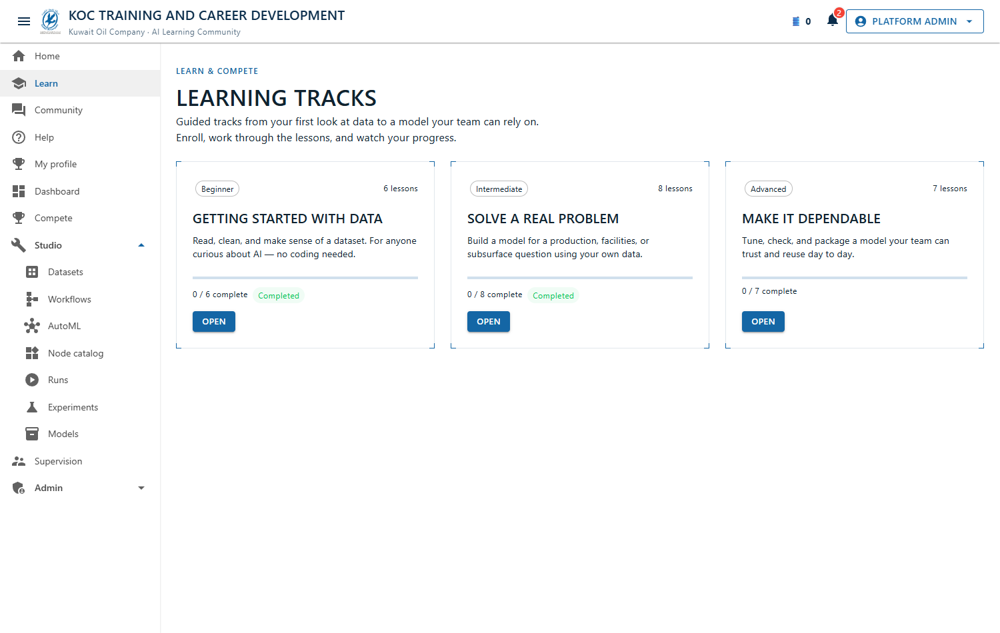

## 4. Build a model in the Studio

The **Studio** is where you turn data into a model. Two ways in:

- **AutoML** (`Studio → AutoML`): the fast path — pick a CSV and a task (binary / multiclass / regression)
  and let the platform find a model for you.
- **Workflow designer** (`Studio → Workflows → Open`, or **New workflow**): the visual, hands-on path.

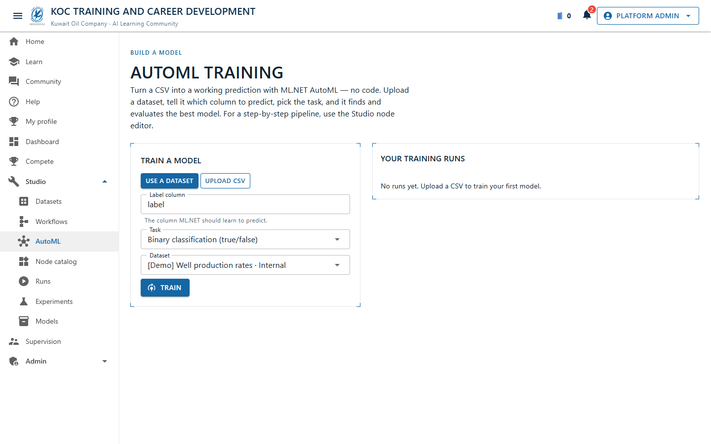

### Using the designer

1. **Drag nodes** from the left palette onto the canvas and **wire** them left-to-right — a typical flow is
   `dataset → (prepare/transform) → split → train → evaluate`.
2. Bring in data with SQL/ETL nodes when you need to: **SQL query**, **Filter**, **Group & aggregate**,
   **Sort**, **Deduplicate**, and **Join / Append another dataset** to combine a second dataset.
3. **Select a node** to configure it in the right-hand property inspector (columns, algorithm, split
   fraction, SQL, etc.).
4. In **Run pipeline**, choose a dataset (or upload a CSV), set the label column and task, and press
   **Run** — you'll see each node execute and a trained metric at the end.
5. **Save draft** as you go; **Publish** freezes an immutable version you can run or submit.

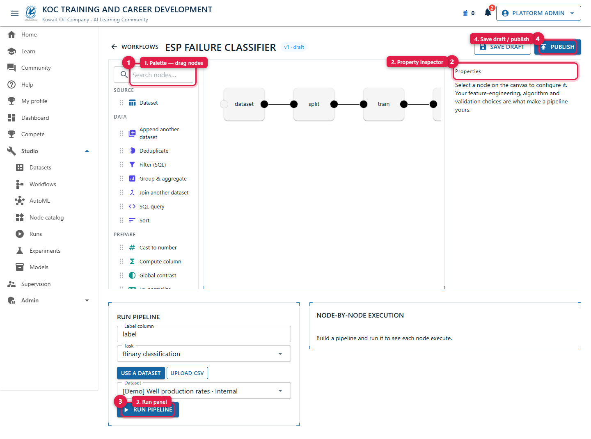

## 5. Datasets

Under **Studio → Datasets** you can create and **version** datasets. When you create one, pick **who can
see it** (Team / Group / Directorate / Company) — you'll see a live count of the potential audience. Upload
a CSV (or import from a URL); publishing freezes a version, and a new upload starts a fresh draft.

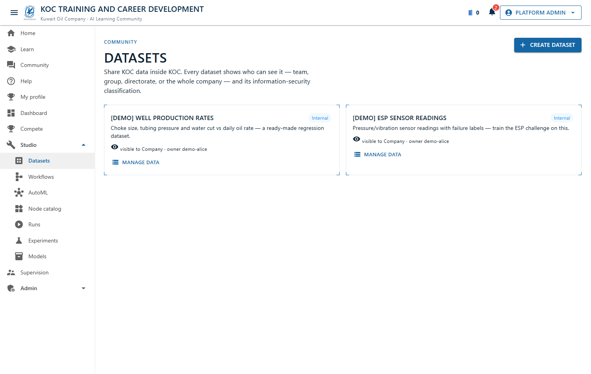

## 6. Compete

**Compete** is the arena: internal, Kaggle-style challenges on real KOC problems. The landing page
leads with the **featured competition** — a live countdown to reveal day, the current top-3 podium,
and an **Enter the arena** button.

1. **Browse** the competition grid — each card shows competitors, submissions, the scoring metric,
   and a countdown. Every competition has **its own page** (`/compete/…`) you can bookmark or share;
   notifications take you straight there.

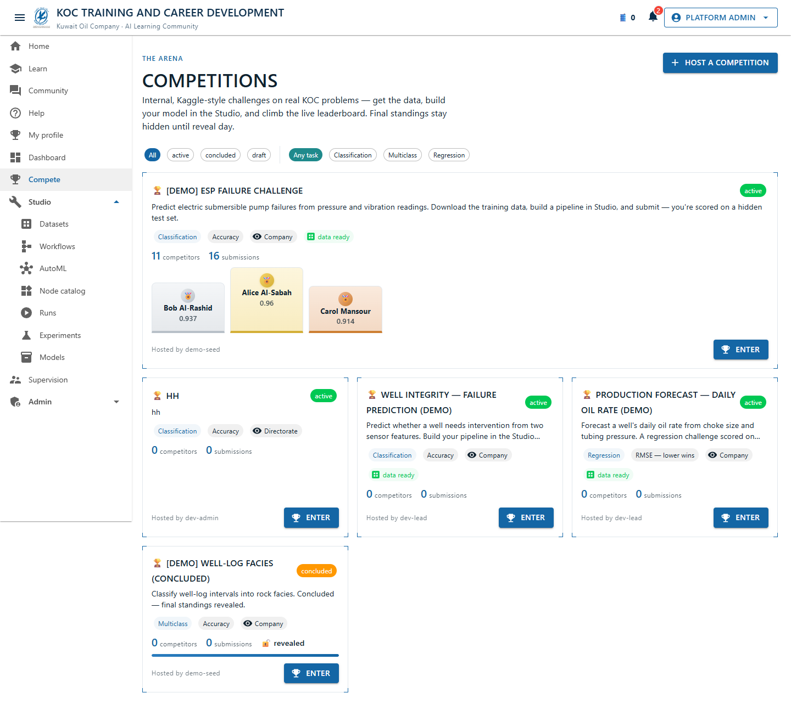

2. **Download** the training set (labelled) and the evaluation set (no labels) from the Data tab.
3. **Build a pipeline** in the Studio for the competition's task.
4. **Submit your pipeline** — the platform trains and scores it on a **hidden** test set (the same data for
   everyone), so only your modelling choices move your rank. Every scored entry earns Barrels; the
   **What you can win** panel on each competition lists the podium rewards and badges.
5. Watch the **live leaderboard** update in real time — rank arrows (▲/▼/NEW) show who's moving.
   Final standings are revealed on the host's chosen day.

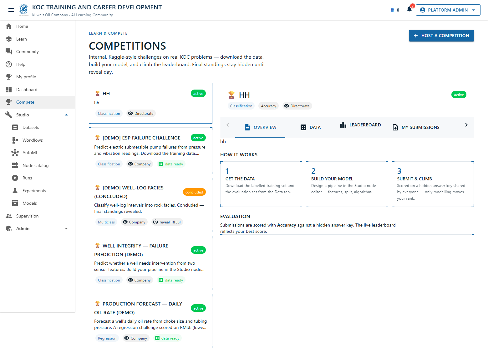

The **Leaderboard** tab is the heart of the arena: a gold/silver/bronze podium sits above the full
standings, your own row is highlighted, and while a competition is live the ranks move in real time
with ▲/▼/NEW arrows. When the host's reveal day arrives, the **final standings** appear below.

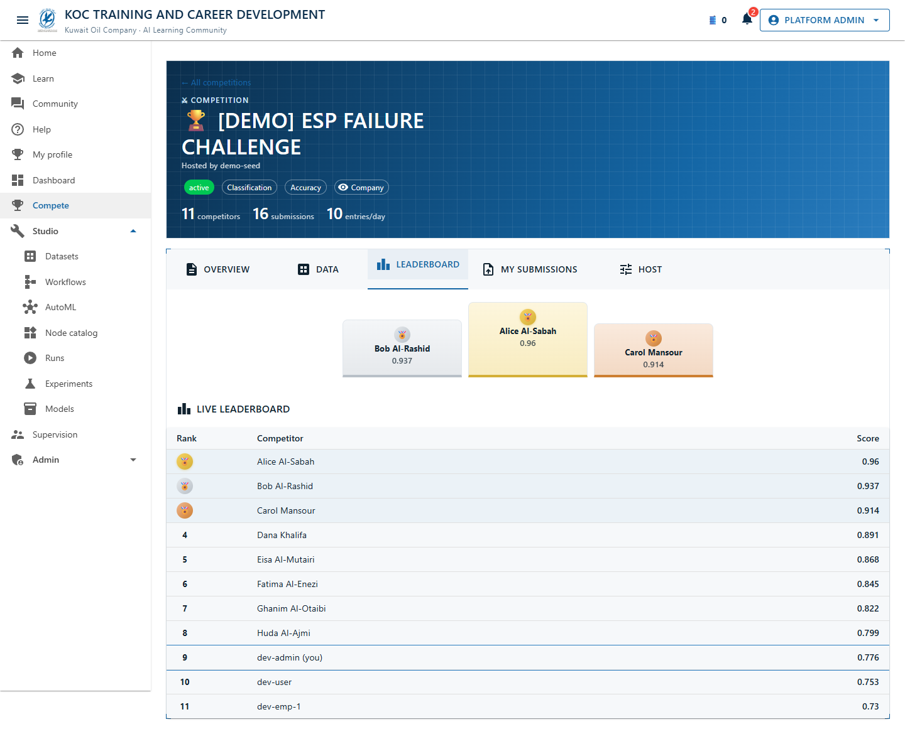

Anyone in a competition's scope can enter. **Hosting** a competition requires permission from an admin — if
you'd like to run one, ask a platform administrator to grant you creator access at the level you need.

## 7. Your profile & standing

**My profile** is your face on the platform — avatar, bio, and skills — plus your earned standing:
**Barrels** (points), **level**, a **streak** for staying active, and **badges**. Give a colleague **kudos**
to recognize good work. Leaderboards (personal and team) show where you stand.

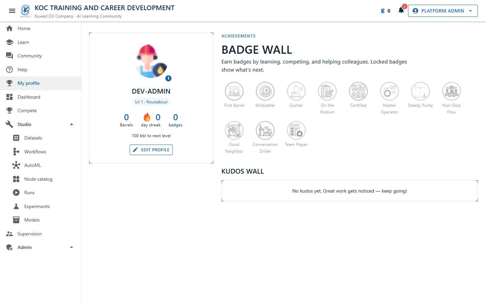

## 8. Community

**Community** is for discussions — ask questions, share solutions, react to posts, and mention colleagues.
It's scoped to your part of the org so the conversation stays relevant.

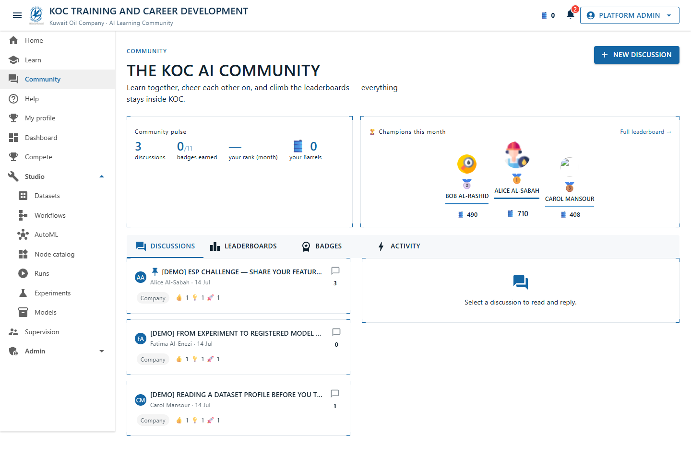

## 9. The desktop app (optional)

There's a **KOC Studio desktop app** — the same designer, but it runs **offline**. You build and *run*
pipelines locally on your machine (no server needed), and connect to the network only to **submit to a
competition**. It signs you in with your Windows account automatically. Drop CSV files into your local
workspace and they appear in the designer's Run panel.

## 10. Tips & FAQ

- **I can't host a competition.** Hosting needs an admin-granted permission (and a level). Ask an admin.
- **My submission scored lower than my local run.** The competition scores on a **hidden** test set — that's
  the honest measure; keep improving your pipeline.
- **A page says my role can't view it.** That area needs a higher role (e.g. Supervision needs a
  team-lead position; Admin needs Platform Admin).
- **The final leaderboard is hidden.** It unlocks at the competition's **reveal** time.
- **Where do I get help?** The in-app **Help** section has searchable articles and FAQs.
